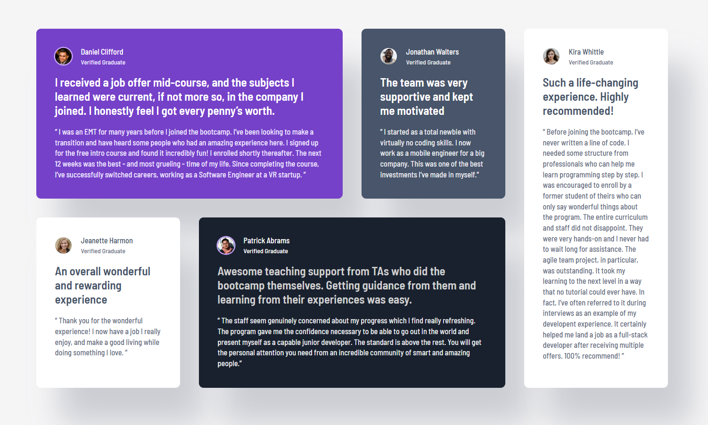

# Frontend Mentor - Testimonials grid section solution

This is a solution to the [Testimonials grid section challenge on Frontend Mentor](https://www.frontendmentor.io/challenges/testimonials-grid-section-Nnw6J7Un7). Frontend Mentor challenges help you improve your coding skills by building realistic projects. 

## Overview

### The challenge

Users should be able to:

- View the optimal layout for the site depending on their device's screen size

### Screenshot

### Links

- Solution URL: [https://github.com/BaraKalvo/FM_testimonials_grid]
- Live Site URL: [https://barakalvo.github.io/FM_testimonials_grid/]

## My process

### Built with

- Semantic HTML5 markup
- CSS custom properties
- Flexbox
- CSS Grid
- Mobile-first workflow

### What I learned

- How to build a responsive layout using CSS Grid
- How to use CSS custom properties in a more advanced way - I created a sort of theming system for individual cards in the layout, where each card has different background color and text colors defined through variables

## Author

- Frontend Mentor - [@BaraKalvo](https://www.frontendmentor.io/profile/BaraKalvo)
